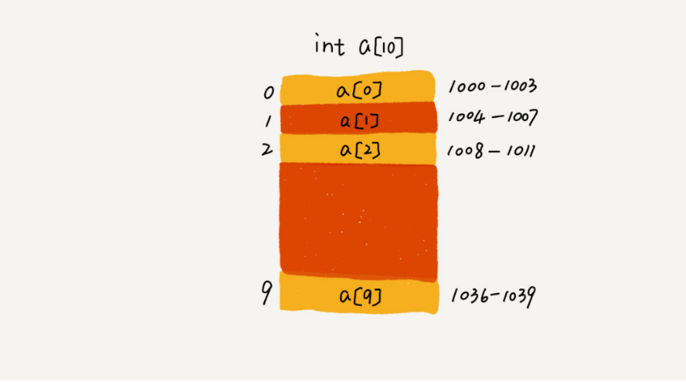

**数组(Array)** 是一种线性表数据结构。它用一组连续的内存空间,来存储一组具有相同类型
的数据。

**线性表(Linear List):** 就是数据排成像一条线一样的结构,每个线性表上的数据最多只有前和后两个方向。其实除了数组,链表、队列、栈等也是线性表结构.

**非线性表** 比如二叉树、堆、图等。之所以叫非线性,是因为,在非线性表中,数据之间并不是简单的前后关系.

一个长度为 10 的 int 类型的数组 int[] a = new int[10],计算机给数组 a[10],分配了一块连续内存空间 1000~1039,其中,内存块的首地址为 base_address = 1000

计算机会给每个内存单元分配一个地址,计算机通过地址来访问内存中的数据。
当计算机需要随机访问数组中的某个元素时,它会首先通过下面的寻址公式,计算出该元素存储的内存地址:
 **a[i]_address = base_address + i * data_type_size** 
 
**数组和链表的区别**
链表适合插入、删除,时间复杂度 O(1);数组适合查找,支持随机访问,根据下标随机访问的时间复杂度为 O(1)。

如果数组从 1 开始计数,那我们计算数组元素 a[k] 的内存地址就会变为: **a[k]_address = base_address + (k-1)*type_size**
从 1 开始编号,每次随机访问数组元素都多了一次减法运算,对于 CPU 来说,就是多了一次减法指令
数组作为非常基础的数据结构,通过下标随机访问数组元素又是其非常基础的编程操作,效率的优化就要尽可能做到极致。所以为了减少一次减法操作,
数组选择了从 0 开始编号,而不是从 1 开始. 这也只是猜测,具体是不是这样也未可知,不过这是最能解释为什么索引下标从0开始了
