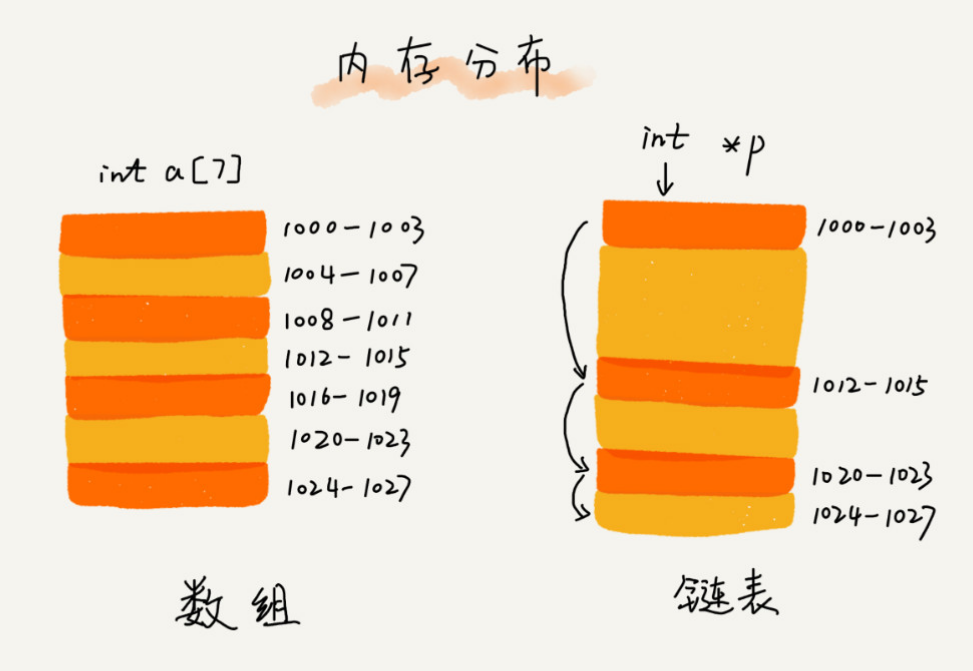
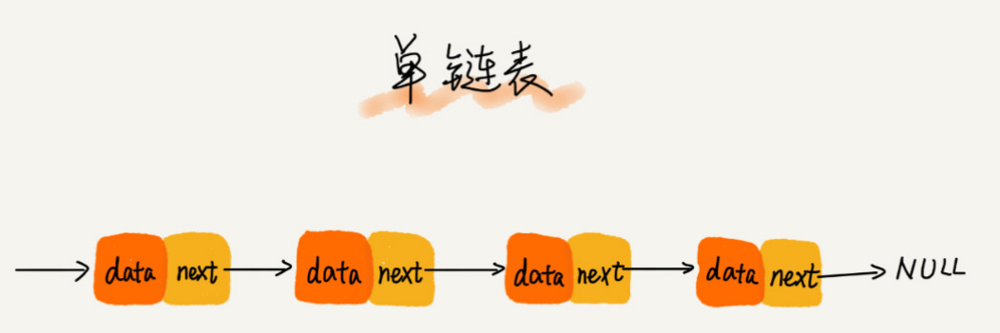
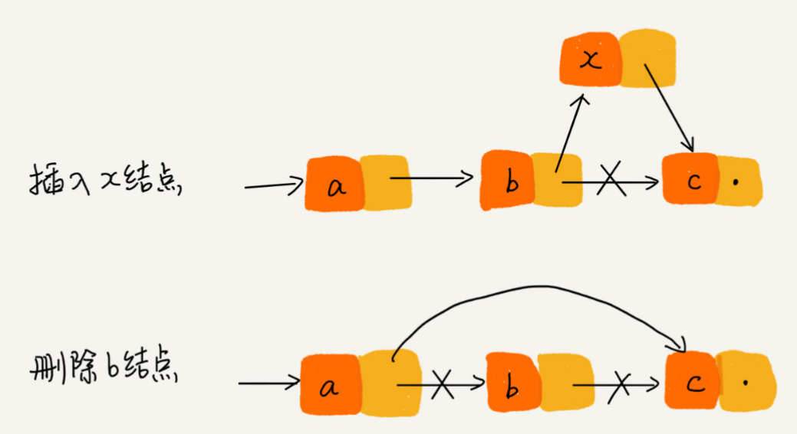
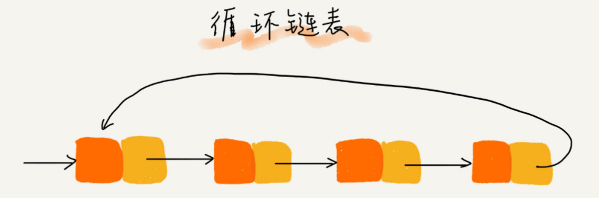
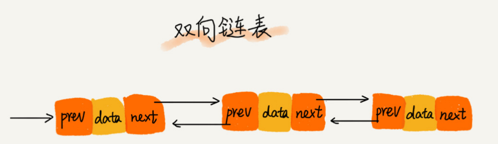
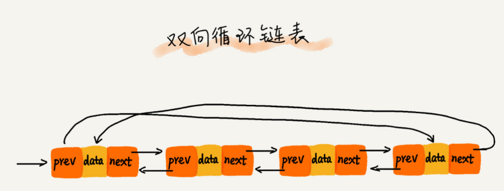
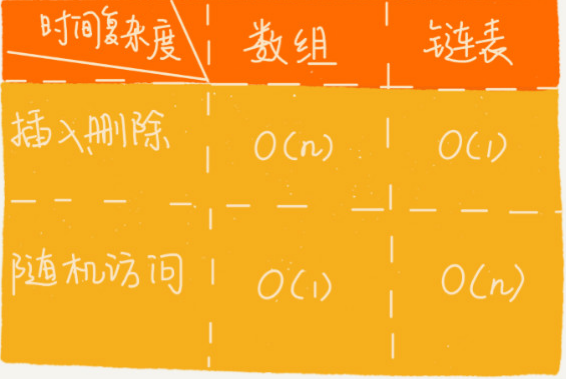

#### 1. 链表和数组的内部分布: 

#### 2. 单链表

    - 链表通过指针将一组零散的内存块串联在一起。我们把内存块称为链表的“结点”
    
    - 每个链表的结点除了存储数据之外,还需要记录链上的下一个结点的地址,这个记录下个结点地址的指针叫作后继指针next.
    
    - 第一个结点叫作头结点,用来记录链表的基地址
    
    - 最后一个结点叫作尾结点, 尾节点的指针不是指向下一个结点,而是指向一个空地址 NULL
    
#### 3. 单链表插入删除

#### 3. 循环链表

#### 4. 双链表

双向链表需要额外的两个空间来存储后继结点和前驱结点的地址。所以,如果存储同样多的数据,双向链表要比单链表占用更多的内存空间。虽然两个指
针比较浪费存储空间,但可以支持双向遍历,这样也带来了双向链表操作的灵活性

#### 5. 双向循环链表

#### 6. 数组链表复杂度分析

#### 7. 数组和链表的优缺点
- 数组优点:数组简单易用,在实现上使用的是连续的内存空间,可以借助 CPU 的缓存机制,预读数组中的数据,所以访问效率更高。
- 链表优点:链表本身没有大小的限制,天然地支持动态扩容
- 数组缺点:大小固定,一经声明就要占用整块连续内存空间。如果声明的数组过大,系统可能没有足够的连续内存空间分配给它,导致“内存不足(out of memory)”。如果声
明的数组过小,则可能出现不够用的情况。这时只能再申请一个更大的内存空间,把原数组拷贝进去,非常费时
- 链表缺点: 链表在内存中并不是连续存储,所以对 CPU 缓存不友好,没办法有效预读。

#### 8. 链表实现LRU淘汰算法
思路: 
1. 如果此数据之前已经被缓存在链表中了,我们遍历得到这个数据对应的结点,并将其从原来的位置删除,然后再插入到链表的头部。
2. 如果此数据没有在缓存链表中,又可以分为两种情况:
- 如果此时缓存未满,则将此结点直接插入到链表的头部;
- 如果此时缓存已满,则链表尾结点删除,将新的数据结点插入链表的头部

